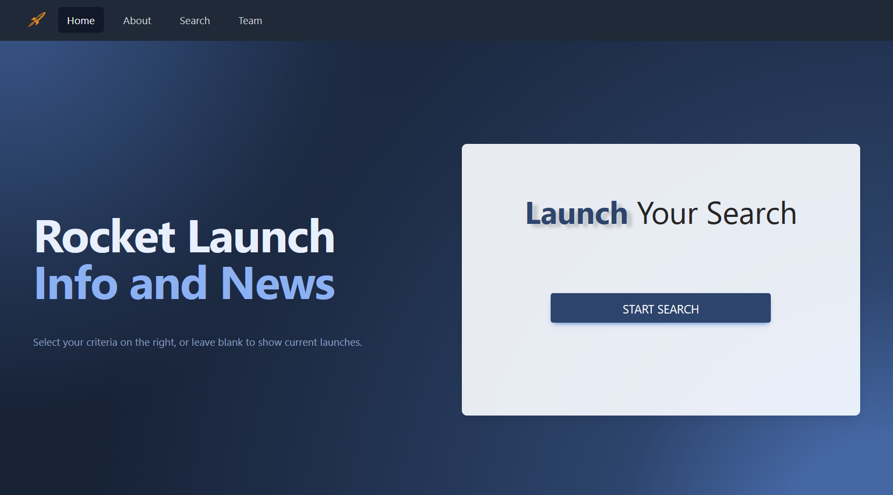
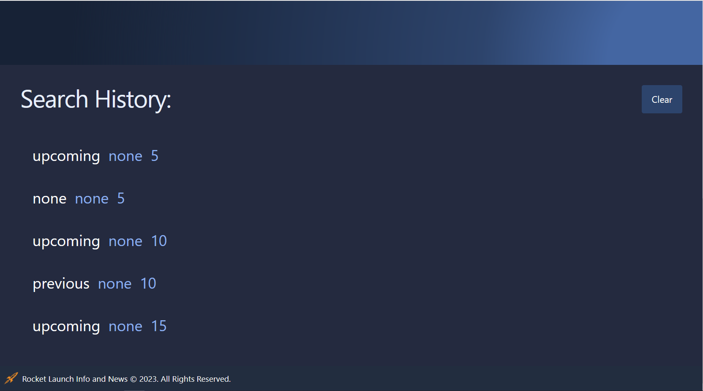
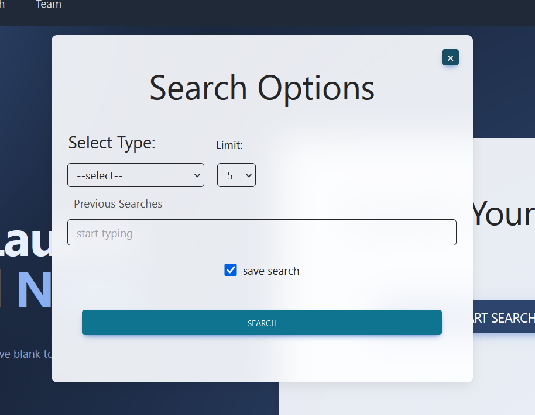
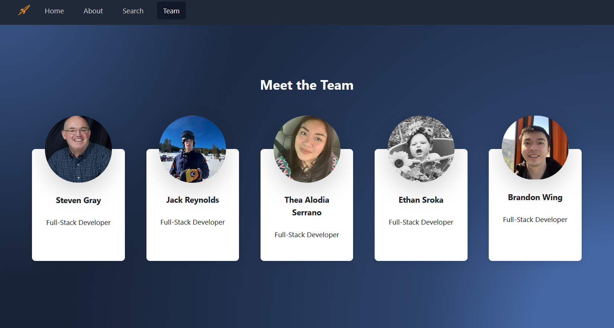

# [Rocket Launches and News Database](https://scraper-nyt-react.herokuapp.com/) ☁️

This is a web application to view current and future launch data and article information.

## Getting Started 🌱

[Application on Github Pages](https://sparkkids.github.io/Team3Project1/)

## Welcome to Rocket Launch, info and news. On the homepage you will find a simple UI.

## Simply click the start search button to begin a new search, or use the navigation inside the search window to select a previous search.

## The Application includes filters including current, past, or upcoming launches; also with the most up-to-date SpaceNews.

## There is an about page explaining the website in more detail, and one including all the authors.

### Future Launches:

- Want to find out what launches are upcoming? Click on "Start Search" from the search page and select "upcoming" from the "Select Type" drop down list box. You are presented a list of all upcoming rocket launches including, descriptions, pictures, and related news articles.

### Specific Launches:

- Have a specific launch you are interested in? This is easy to do. Click on "Start Search" from the search page and select "specific" from the "Select Type" drop down list box. This displays a "Search Term" text entry box for entering your search terms. interested in learning about launches using Space X's Falcon 9 launch vehicles? Enter "Falcon 9" in the Search Term text entry box. You are then presented with a list of rocket launches that use a version of Space X's Falcon 9 launch vehicle.

### Past Launches:

- Click on "Start Search" from the search page and select "previous" from the "Select Type" drop down list box. You are presented a list of previous rocket launches including, descriptions, pictures, and related news articles.

### Prerequisites 📂

None

### Installation 📁

Simply run the index.html file in a browser window.

## Built With 🌱

- ### HTML, JavaScript, and CSS

- [![Bootstrap][Bootstrap.com]][Bootstrap-url] - CSS framework
- [![JavaScript][JavaScript.com]][JavaScript-url] - programming language
- [![JQuery][JQuery.com]][JQuery-url] - JS framework
- [![Tailwind][Tailwind.com]][Tailwind-url] - CSS framework

## Authors 🔑

- **Ethan Sroka** - [ethancs13](https://github.com/ethancs13)
- **Steven Gray** - [SparkKids](https://github.com/SparkKids)
- **Jack Reynolds** - [jrey136](https://github.com/jrey136)
- **Thea Serrano** - [tvserr](https://github.com/tvserr)
- **Brandon Wing** - [Bwing2](https://github.com/Bwing2)

[JQuery.com]: https://img.shields.io/badge/jQuery-0769AD?style=for-the-badge&logo=jquery&logoColor=white
[JQuery-url]: https://jquery.com
[JavaScript.com]: https://img.shields.io/badge/JavaScript-blue?style=for-the-badge&logo=Javascript
[JavaScript-url]: https://www.javascript.com/
[Bootstrap.com]: https://img.shields.io/badge/bootstrap-blue?style=for-the-badge&logo=Bootstrap&logoColor=white
[Bootstrap-url]: https://getbootstrap.com/
[Tailwind.com]: https://img.shields.io/badge/tailwind-blue?style=for-the-badge&logo=Tailwind&logoColor=blue
[Tailwind-url]: https://getbootstrap.com/
